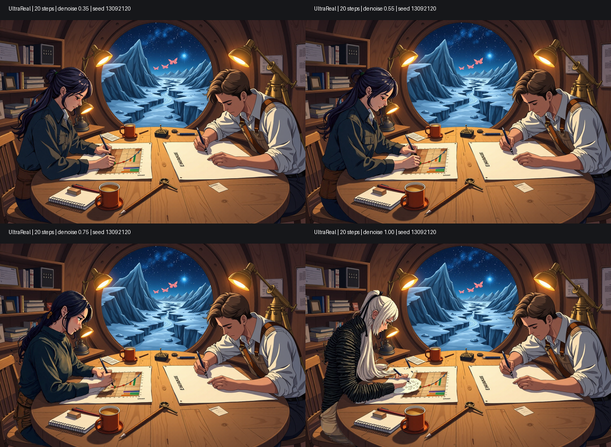
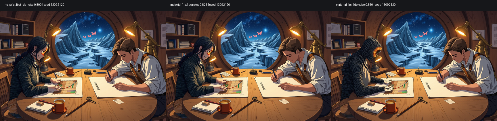
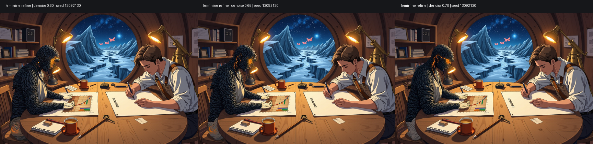
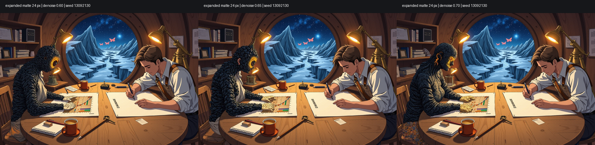

# Iterative inpainting is image construction

Status: measured workflow and product direction  
Date: 2026-09-14

## The operation is a pass, not a caption

Inpainting should not ask one prompt to redescribe the whole desired image. The
source image already carries the scene, composition, identity, pose, lighting,
and every accepted decision from earlier work. A refinement pass names the one
property that should change now and lets the source carry the rest.

The first phrase of the prompt therefore describes the desired replacement:

```text
A rock person made entirely from layered charcoal-black basalt ...
```

It should not spend its highest-attention words reintroducing the character,
portrait format, room, or story before saying what must change. Once the stone
material exists in the next source, a later lower-denoise pass may instead lead
with another objective:

```text
A human woman's face with clearly recognizable feminine anatomy ...
```

That is not a contradiction between prompts. Each prompt is an instruction for
one pass over a progressively more correct image.

## The working loop

1. Pick the current best source rather than returning automatically to the
   original.
2. Name one pass objective: material, silhouette, face, hands, action, garment,
   lighting, or another visually separable property.
3. Mask only the subject or feature that may change.
4. Give the editable mask enough boundary allowance to alter its silhouette.
5. Lead the prompt with the replacement wanted in this pass.
6. Generate a small, controlled denoise comparison with other variables fixed.
7. Promote the best candidate to the next source.
8. Lower denoise and narrow the mask as the image becomes more correct.

This is progressive construction. A candidate may be a successful material
pass and an unfinished image at the same time.

## Denoise is semantic freedom

Denoise strength controls more than visual intensity. It changes how much of
the source's semantic solution the model may renegotiate.

- **High denoise** is useful when the current subject is categorically wrong:
  human to rock person, empty room to furnished room, or standing to seated.
- **Medium denoise** can recover anatomy, expression, clothing, or action while
  retaining a successful material and composition.
- **Low denoise** is for surface and local finishing after the important forms
  already exist.

The numeric ranges are model- and sampler-dependent. They are observations to
measure, not global presets. For the normal-step Flux checkpoint used in the
study below, `0.80` and `0.825` still interpreted basalt mostly as clothing,
while `0.85` crossed abruptly into an unmistakable rock person. Refining that
candidate around `0.60` to `0.70` recovered more human form without discarding
the stone material.

Fast distilled checkpoints can behave differently. The tested four-step Flux
merge preserved nearly everything below its transition and became unstable at
full denoise. It was useful for drafts, but was not a reliable masked
regeneration brush in this path. Model profiles should record measured inpaint
behavior rather than assuming that txt2img speed predicts refinement quality.

## A semantic mask is not an editable mask

Segmentation answers which pixels currently belong to an object. Refinement
also needs room to change where that object ends.

Keep these controls distinct:

- **semantic mask** — the segmented object or deliberately painted feature;
- **mask expansion** — pixels outside that segmentation that the model may
  actually rewrite;
- **mask blur** — transition softness at the editable boundary;
- **crop padding** — surrounding pixels shown to a focused inpaint crop as
  context, but not thereby made editable.

In Forge, focused-inpaint padding did not replace actual mask expansion. A
tight Terra mask plus 32 pixels of crop padding still constrained the new shape
to the old silhouette. Expanding the matte by 24 pixels let the model reshape
the head, hair, shoulders, and garment boundary. It also demonstrated the cost:
editable area that reaches unrelated clothing or furniture permits those pixels
to change. The UI must show the expanded matte, not only its original semantic
selection.

## Measured Terra study

This sequence transformed an existing seated human character into Terra, a
human-form basalt entity, without regenerating the successful room or the other
character. The images are experimental evidence, not aesthetic acceptance of
every candidate.

### 1. Find the model's transformation range



With the same source, mask, prompt, seed, and 20-step normal Flux model, low and
medium strengths preserved the original human solution. Full denoise produced
a coherent transformation rather than the white collapse observed in the
four-step merge. This established that the normal model was a better refinement
brush and located the high-denoise end of the useful range.

### 2. Put the material first



Changing the prompt from a whole-character description to `A rock person made
entirely from layered charcoal-black basalt` materially changed the result.
At `0.80` and `0.825`, the source identity still dominated. At `0.85`, the model
finally treated rock as the subject rather than a costume. The result had lost
feminine anatomy and facial readability, but it was a successful material pass
and therefore became the next source.

### 3. Recover form at lower denoise



The next prompt asked for feminine form while the source supplied the already
successful stone material. At `0.60` to `0.70`, a tight subject mask recovered
some anatomy but remained constrained by the existing outline.



Repeating that pass with a 24-pixel expanded matte gave the model enough room
to reshape the silhouette and made the `0.70` candidate substantially more
human-like. It also changed pixels at the garment and seat boundary. The next
passes therefore narrowed to the head, then the hands and drawing contact,
rather than repeatedly exposing the entire figure.

The hands pass did not yet restore convincing anatomy or pencil contact. That
negative result matters: a text-only local inpaint is not automatically the
right instrument for precise action choreography. A pose, edge, sketch, or
other explicit condition may be needed when the relationship between body and
object is the pass objective.

## Product representation

`Refine` should create a visible, branchable pass relation rather than silently
replacing the current source:

```text
RefinementPass
  id
  parent_asset_id
  result_asset_id?
  objective
  resolved_prompt
  semantic_mask_asset_id?
  editable_mask_asset_id?
  mask_expansion_px
  mask_blur_px
  crop_padding_px
  denoise
  model_profile
  conditions[]
  seed
  state
```

The pass objective is short human-facing intent, not another hidden prompt. It
lets the interface say `material pass`, `face pass`, or `restore pencil contact`
while the realization preserves the exact engine request.

The Stage should support:

- **Continue refining** from any candidate or frame version;
- a visible parent/source breadcrumb;
- before/after and sibling comparison;
- semantic-mask, expanded-mask, and final-composite previews;
- direct numeric and visual control of mask expansion;
- small denoise ladders with all other variables locked;
- promotion of one candidate as the source for the next pass;
- a pass history that remains branchable and never destroys prior assets;
- conditions such as pose, depth, edge, or sketch attached to the pass that
  actually needs them.

The default prompt editor for an inpaint pass should not repopulate a complete
caption merely because the source has one. It should foreground the current
objective and keep inherited recipe/context available separately.

## Acceptance boundaries

- Pixels outside the editable mask remain sourced from the parent except for a
  deliberate, visible compositing transition.
- Changing crop padding alone never claims to expand the editable mask.
- The saved realization distinguishes segmentation, expansion, blur, padding,
  and focused/full-frame policy.
- A promoted candidate becomes an attributable parent of the next pass; it is
  not an unrecorded overwrite.
- Comparing denoise values locks the source, mask, model, sampler, scheduler,
  prompt, seed, and conditions unless the interface names another change.
- Stopping after a good material pass does not label the image finished, and a
  later failed detail pass cannot destroy that successful intermediate.
